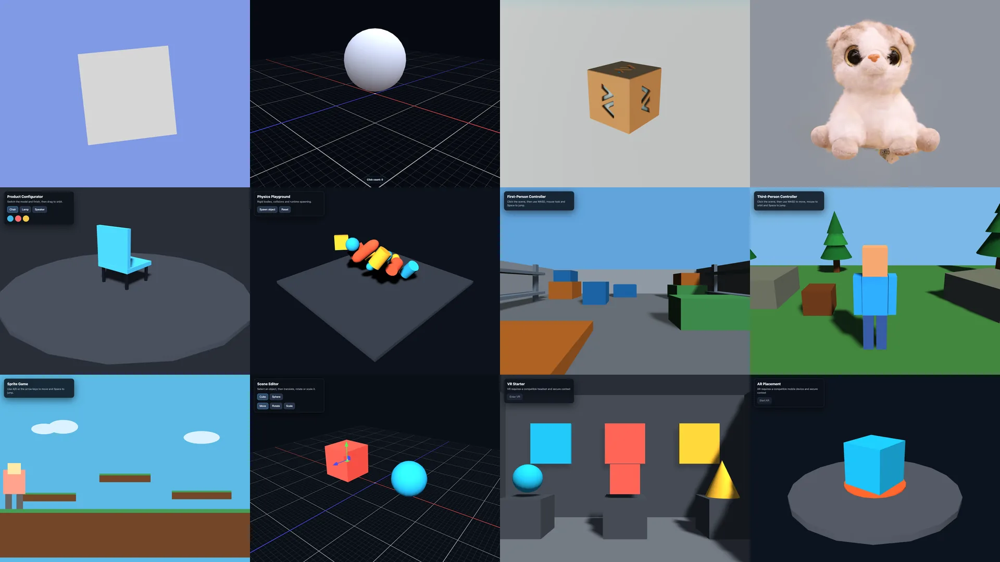

# create-playcanvas

[](https://www.npmjs.com/package/create-playcanvas)
[](https://npmtrends.com/create-playcanvas)
[](LICENSE)
[](https://discord.gg/RSaMRzg)
[](https://www.reddit.com/r/PlayCanvas)
[](https://x.com/intent/follow?screen_name=playcanvas)

| [Engine Manual](https://developer.playcanvas.com/user-manual/engine/) | [React Manual](https://developer.playcanvas.com/user-manual/react/) | [Examples](https://playcanvas.github.io/) | [Forum](https://forum.playcanvas.com/) |

Scaffold a Vite-powered PlayCanvas project with TypeScript. Pick a format and a runnable starter, then build from there.

## Getting Started

```bash
# npm
npm create playcanvas@latest
# pnpm
pnpm create playcanvas@latest
# yarn
yarn create playcanvas
# bun
bun x create-playcanvas@latest
```

Then follow the prompts. Requires Node.js 22.23.2 or later.

## Formats

| Format           | Description                                  |
| ---------------- | -------------------------------------------- |
| `engine`         | The PlayCanvas Engine API directly           |
| `react`          | `@playcanvas/react` components               |
| `web-components` | `@playcanvas/web-components` custom elements |

Every format uses TypeScript and includes Vite, ESLint, Prettier and a production build.

## Starters

Every starter is available in every format. Choose from basics, viewers, games, tools and XR; `spinning-cube` is the default.



[Browse the starter catalog](STARTERS.md).

## CLI Options

Pass a project name and options to skip the prompts:

```bash
npm create playcanvas@latest my-game -- -f react -y
```

| Option             | Shorthand | Description                                             |
| ------------------ | --------- | ------------------------------------------------------- |
| `--format <name>`  | `-f`      | Use a format from the list above                        |
| `--starter <name>` | `-s`      | Use a starter from the list above                       |
| `--overwrite`      |           | Remove existing files from a non-empty target directory |
| `--no-skills`      |           | Omit the PlayCanvas agent skills (included by default)  |
| `--yes`            | `-y`      | Skip the prompts and take the defaults                  |
| `--help`           | `-h`      | Show command help                                       |

`--yes` takes `playcanvas-project`, the `engine` format and the `spinning-cube` starter for anything you don't pass. It never deletes files, so a non-empty target directory still needs `--overwrite`. The previous `--template` and `--boilerplate` long flags remain accepted for compatibility.

## Agent skills

Every project includes [`@playcanvas/skills`](https://github.com/playcanvas/skills) so AI coding agents such as Claude Code, Codex and Cursor pick up PlayCanvas-specific workflows automatically, with no install step. They are copied into `.claude/skills/` and `.agents/skills/`. Pass `--no-skills` to leave them out.

## Development

```bash
npm install
npm run build
node dist/index.mjs
```

Contributions are welcome. Please open an issue before proposing a new format, starter or another substantial change.

## License

[MIT](LICENSE)
